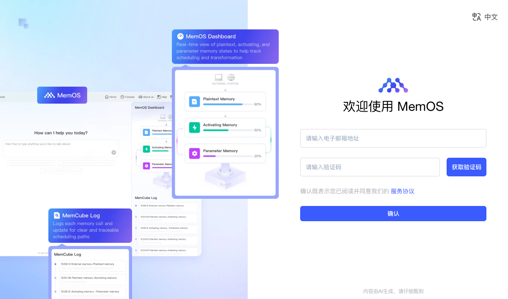
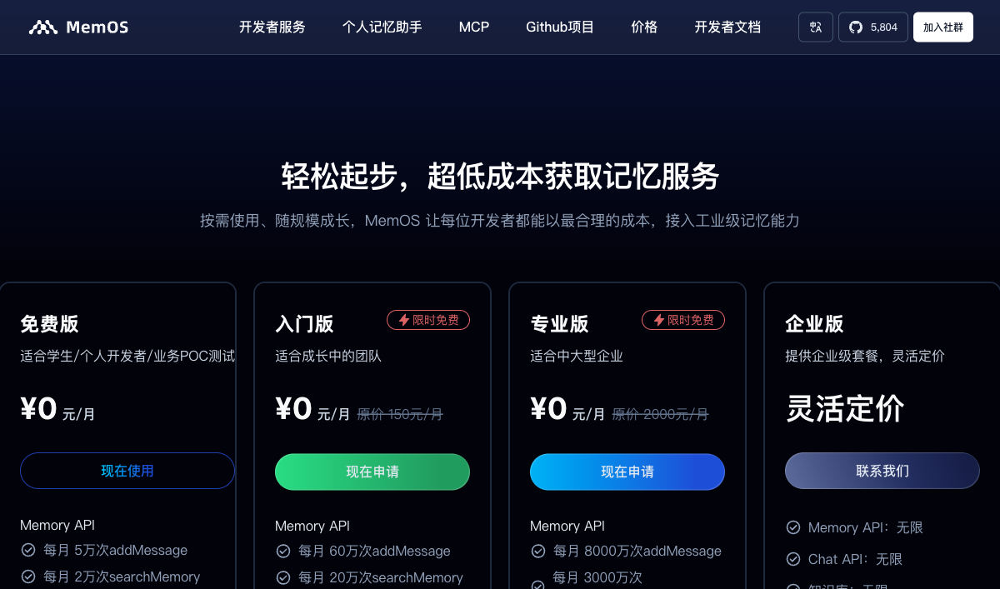

# Proma 记忆功能使用教程

> 让 AI 助手真正"记住"你 —— 跨会话的长期记忆能力

## 什么是记忆功能？

Proma 的记忆功能让 AI 助手能够跨会话记住你的偏好、决策和项目上下文。就像一个长期搭档，它会记住你们一起讨论过的问题、做过的决定、踩过的坑，而不是每次对话都从零开始。

记忆功能由 [MemOS Cloud](https://memos-dashboard.openmem.net) 提供支持，**Chat 模式和 Agent 模式均可使用**。

### 核心能力

| 能力 | 说明 |
|:---|:---|
| 记住偏好 | "我习惯用 pnpm"、"缩进用 2 空格" |
| 记住决策 | "我们选了 JWT 方案，因为..." |
| 记住上下文 | "项目路径在 /xxx/yyy" |
| 自动回忆 | 下次对话自动关联过去的经历 |

### 免费额度

- 每月 **5 万次** 添加记忆
- 每月 **2 万次** 查询记忆
- 对绝大部分用户完全够用

---

## 第一步：注册 MemOS Cloud 账号

1. 打开浏览器，访问 [MemOS Cloud 控制台](https://memos-dashboard.openmem.net)

2. 你会看到 MemOS 的登录/注册页面，输入邮箱和验证码即可完成注册



3. 登录后，进入 **API Keys** 页面

4. 点击 **生成 API Key**，复制生成的 Key（以 `mpg-` 开头）

> ⚠️ API Key 只会显示一次，请妥善保存！

### 免费额度一览



---

## 第二步：在 Proma 中配置记忆

1. 打开 Proma，点击左下角 **设置图标** ⚙️

2. 在设置面板中，点击 **「记忆」** 标签页

3. 你会看到记忆设置界面，包含以下元素：
   - 顶部：记忆功能的 **启用开关**
   - 中间：MemOS Cloud 的说明和配置步骤引导
   - 下方：**API Key 输入框**、**测试连接** 按钮、**保存** 按钮

<!-- TODO: 补充 Proma 记忆设置界面截图 -->
<!--  -->

4. 将复制的 API Key 粘贴到输入框中

5. 点击 **「测试连接」** 按钮，验证 Key 是否有效
   - 成功：显示绿色提示 "连接成功，已检索到 X 条事实、X 条偏好"
   - 失败：显示红色提示 "连接失败: Invalid API Key"

6. 连接成功后，点击 **「保存」**，然后打开右上角的 **启用开关** 🔘

> 💡 开关打开后，记忆功能立即生效，无需重启 Proma。

---

## 第三步：开始使用记忆

记忆功能开启后，AI 助手会自动在对话中使用记忆，无需任何额外操作。

### 🧠 AI 会自动"记住"什么？

AI 会在对话中判断哪些信息值得记住，包括但不限于：

- **你的偏好**：技术栈选择、编码风格、工具习惯
- **重要决策**：架构方案、技术选型及原因
- **项目上下文**：项目路径、关键配置、团队约定
- **问题解决经验**：踩过的坑和解决方案

### 🔍 AI 会自动"回忆"什么？

当你开始新对话时，AI 会根据当前话题自动检索相关记忆：

- 你提到"之前"、"上次"、"我们讨论过"
- 当前任务和过去的经历有关联
- 需要延续之前的讨论或决策

### 💬 实际对话示例

**会话 A — 第一次交互：**

```
👤 你: 我的项目用 TypeScript + React，我喜欢用 function component + hooks

🤖 AI: 好的，了解了！
        ┌──────────────────────┐
        │ 🧠 正在记住…         │  ← 记忆工具指示器
        └──────────────────────┘
        ┌──────────────────────┐
        │ 🧠 ✓ 已记住          │  ← 记忆存储成功
        └──────────────────────┘
```

> 后台自动提取并存储：
> - 事实：用户的项目用 TypeScript + React
> - 偏好：用户喜欢用 function component + hooks

**会话 B — 一周后的新对话：**

```
👤 你: 帮我写一个表单组件

        ┌──────────────────────┐
        │ 🧠 正在回忆…         │  ← 自动检索相关记忆
        └──────────────────────┘
        ┌──────────────────────┐
        │ 🧠 ✓ 回忆完成        │  ← 找到了之前的偏好
        └──────────────────────┘

🤖 AI: 这是一个用 TypeScript 编写的 function component 表单：

        const LoginForm: React.FC = () => {
          const [form, setForm] = useState({ ... })
          ...
        }
```

> AI 自动应用了你的技术栈偏好，无需重复说明！

### 📌 你也可以主动要求记住

```
👤 你: 记住这个：以后所有组件都放在 src/components 目录下

🤖 AI: 好的，记住了。
        ┌──────────────────────┐
        │ 🧠 ✓ 已记住          │
        └──────────────────────┘
```

---

## 记忆工具指示器说明

在对话过程中，你会在 AI 回复上方看到记忆工具的状态指示器：

| 状态 | 显示 | 含义 |
|:---|:---|:---|
| ⏳ 🧠 正在回忆… | 旋转动画 | AI 正在检索相关记忆 |
| ✅ 🧠 回忆完成 | 绿色对勾 | 成功找到相关记忆 |
| ⏳ 🧠 正在记住… | 旋转动画 | AI 正在存储新记忆 |
| ✅ 🧠 已记住 | 绿色对勾 | 记忆存储成功 |
| ❌ 🧠 回忆完成（失败） | 红色叉号 | 检索失败（不影响对话） |

> 💡 即使记忆工具偶尔失败，也不会影响正常对话，AI 会继续回答你的问题。

---

## Chat 模式 vs Agent 模式

记忆功能在两种模式下都可用，但工作方式略有不同：

| | Chat 模式 | Agent 模式 |
|:---|:---|:---|
| 记忆工具 | `recall_memory` / `add_memory` | `mcp__mem__recall_memory` / `mcp__mem__add_memory` |
| 工具轮次 | 最多 5 轮自动续接 | 由 Agent SDK 自动管理 |
| 适合场景 | 日常对话、快速问答、偏好记录 | 复杂任务、项目开发、多步骤工作流 |

两种模式共享同一份记忆数据，在 Chat 中记住的内容，Agent 模式也能回忆起来，反之亦然。

---

## 常见问题

### Q: 记忆存储在哪里？

记忆数据存储在 MemOS Cloud 云端，通过你的 API Key 关联。本地只保存配置信息（`~/.proma/memory.json`），不保存记忆内容。

### Q: 记忆功能会影响对话速度吗？

影响很小。记忆检索通常在 1-2 秒内完成，存储是异步的，完全不阻塞对话。

### Q: 我可以查看/管理已存储的记忆吗？

可以。登录 [MemOS Cloud 控制台](https://memos-dashboard.openmem.net)，在 Memory 页面可以查看、搜索和删除已存储的记忆。

### Q: 如何关闭记忆功能？

进入 设置 → 记忆，关闭右上角的开关即可。关闭后 AI 不会再检索或存储记忆，但已有的记忆数据不会被删除。

### Q: 换了电脑还能用吗？

可以。只要使用同一个 API Key，记忆数据就能在任何设备上访问。

### Q: 记忆功能支持哪些模型？

所有 Proma 支持的模型都可以使用记忆功能，包括 Claude、GPT、Gemini 等。记忆工具是在 Proma 层面注入的，与底层模型无关。

---

## 快速配置清单

- [ ] 访问 [MemOS Cloud](https://memos-dashboard.openmem.net) 注册账号
- [ ] 生成并复制 API Key
- [ ] 打开 Proma 设置 → 记忆
- [ ] 粘贴 API Key
- [ ] 点击「测试连接」确认成功
- [ ] 点击「保存」
- [ ] 打开启用开关
- [ ] 开始对话，享受跨会话记忆！
